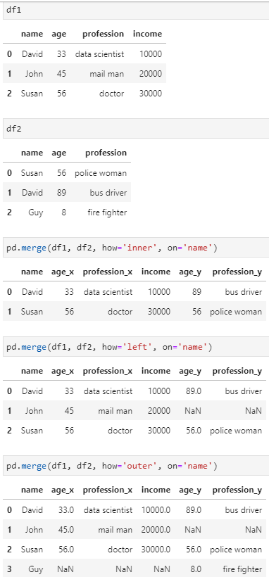

# Cheatsheets

## Linux

| Command                                   | Description                                                 |
| ----------------------------------------- | ----------------------------------------------------------- |
| `df -h /`                                 | Show total free disk space                                  |
| `ls -haltr`                               | list files by date (human readable, reversed)               |
| `du -sh folder`                           | Show size of folder                                         |
| `ls \| wc -l`                             | Number of files in folder                                   |
| `rm -r mydir`                             | Delete folder                                               |
| `cp -avr home/sourcedir home/destinydir`  | Copy folder with all content                                |
| `echo hello > $(date +%Y%m%dT%H%M%S).txt` | Saves output of command in file <br> with timestamp as name |
| `mkdir -p folder/{1..10}`                 | Make 10 subfolders                                          |
| `ctrl + z`                                | suspend running process                                     |
| `ps f`                                    | show processes                                              |
| `fg`                                      | resume stopped process (in foreground)                      |
| `bg`                                      | resume stopped process (in background)                      |
| `jobs`                                    | show jobs                                                   |
| `kill <PID>`                              | kill process with ID <PID>                                  |
| `sleep 360 &`                             | starts sleep command in background                          |
| `cat /etc/os-release`                     | show which linux distro is installed                        |
| `rwx, 421 (e.g. chmod 600 <file>)`        | change permissions                                          |
| `mv/cp <old> <new>`                       | rename/copy  file                                           |
| `ls/rm *.mp3`                                | list/delete all mp3                                                |
| `cd`                                | same as  `cd ~`                                              |
| `pushd` <folder>, `popd`                                  | go into folder, go back where you came from                                            |
| `file song.mp3`                                | shows type of file, here: mp3                                         |
| `locate <file name>`                                | find <file name>                                           |
| `sudo updatedb `                                | update db for locate                                        |
| `cal`                                | show calender                                           |
| `whatis scp`                                | return: secure copy (remote file copy program)                                         |
| `apropos time`                                | show commands related to time                                          |
| `man time`                                | show manual for time                                          |
| `cat >> file, ctrl-d to exit`                                | opens editor and saves what you write in file                                          |
| `cat file1 file2`                                | concatenates files                                          |
| `more/less file2`                                | pager/scroller for file2                                          |
| export PATH=/home/pi/.local/bin:$PATH  | add to path in .bashrc |
|pkill -u [username] | kill all processes belonging to [username]|
|`ifconfig \| grep inet`|get ip|
|`alias l='ls -AF'`                                | alias a comand                                         |

## sudo (linux)

if commands after sudo don't work:

Just remove the PATH reset in /etc/sudoers. It's likely a rule called secure_path

## Github

| Command                                                                          | Description                                                                                                    |
| -------------------------------------------------------------------------------- | -------------------------------------------------------------------------------------------------------------- |
| `git rm --cached <filename>`<br> `commit and push`                               | Remove file on origin master                                                                                   |
| `git log --oneline`                                                              | print logs only as one line                                                                                    |
| `git config --global --edit`                                                     | change global default of comitter (name, email)                                                                |
| `git branch <branch-name>`                                                       | create new branch                                                                                              |
| `git checkout <branch-name>`                                                     | switch to <branch-name> (can also be a remote one)                                                             |
| `git checkout -b <branch-name>`                                                  | create new branch <branch-name> and switch to it                                                               |
| `git push origin --delete <branch-name>`                                         | delete remote branch                                                                                           |
| `git branch -d <branch-name>`                                                    | delete local branch                                                                                            |
| `git rebase -i HEAD~2`                                                           | rewrite last commit message                                                                                    |
| `git rebase -i HEAD~2, edit, git reset HEAD^, add/commit, git rebase --continue` | split commit message                                                                                           |
| `git tag v1.0`                                                                   | make tag/release                                                                                               |
| `git push origin v1.0`                                                           | push release                                                                                                   |
| `git checkout -b <branch name> v1.0`                                             | checkout release                                                                                               |
| `git merge origin/master`                                                        | merge origin/master                                                                                            |
| `git pull origin`                                                                | same as git fetch origin, git merge origin/master                                                              |
|`git checkout otherbranch myfile.txt` | Copy a file from one branch to another|
|`git remote set-url origin NEW_URL`| change remote url|

## Github: Fixing common mistakes

| Command                                                                                                                                                                 | Description                                                                        |
| ----------------------------------------------------------------------------------------------------------------------------------------------------------------------- | ---------------------------------------------------------------------------------- |
| `git checkout file.py`                                                                                                                                                  | undo changes up to last commit of file.py                                          |
| `git commit --amend -m 'corrected message'`                                                                                                                             | correct wrong commit message of last commit                                        |
| `git add file.py, git commit --amend`                                                                                                                                   | forgot to add file.py to last commit                                               |
| `git checkout <correct branch>, git cherry-pick <commit hash>, git checkout <wrong branch>, git reset (--soft/--mixed (default)/--hard) <commit hash before wrong one>` | commited on wrong branch                                                           |
| `git clean --df`                                                                                                                                                        | undo untracked changes of files and directories (e.g. when accidentally unzipping) |
| `git reflog, git checkout <hash> (detatched head state), git branch <branch-name>`                                                                                      | go back to certain commit and make branch of this state                            |
| `git reset file.py`                                                                                                                                                     | undo git add file.py                                                               |

## VS Code

| Command           | Description                     |
| ----------------- | ------------------------------- |
| `option-shift-F`  | format file (e.g. with Black)   |
| `cmd-X`           | cut a line                      |
| `shift-cmd-K`     | delete a line                   |
| `cmd-L`           | select the line                 |
| `cmd-Enter`       | insert a new line below it      |
| `shift-cmd-Enter` | insert a new line above it      |
| `⌥↑ and ⌥↓`       | move the line up/down           |
| `shift-cmd-7`     | comment line                    |
| `command-P`       | Opens search palette            |
| `command-shift-P` | Opens command palette           |
| `command-shift-O` | Search by method/function/class |
| `option-shift-F`  | Format file (e.g. with Black)   |
| `control-shift-^` | Open terminal                   |
| `command-J`       | Collapse/ bring back terminal   |
| `:32 (in search)` | Jump to line 32                 |

More vs code shortcuts:
https://gist.github.com/bradtraversy/b28a0a361880141af928ada800a671d9

common vscode python setup:

```json
{
    "python.pythonPath": "/home/david/.local/share/virtualenvs/menu_planner-1CZiAFCI/bin/python",
    "editor.formatOnSave": true,
    "python.formatting.provider": "yapf",
    "python.linting.flake8Enabled": true,
    "files.insertFinalNewline": true
}
```


## Python

| Command                      | Description                        |
| ---------------------------- | ---------------------------------- |
| `python -W ignore script.py` | Run python script without warnings |
| `state = "nice" if is_nice else "not nice"` | ternary operator |

## os (python)

| Command                      | Description                        |
| ---------------------------- | ---------------------------------- |
| `os.path.basename('/var/lib/db.txt')` | name of file ('db.txt') |
| `os.path.dirname('/var/lib/db.txt')` | name of file ('/var/lib') |


## JavaScript

| Command                      | Description                        |
| ---------------------------- | ---------------------------------- |
| `state = isMember ? '$2.00' : '$10.00'` | ternary operator |

## yapf

| Command                      | Description                        |
| ---------------------------- | ---------------------------------- |
| `yapf -i -r .` | format all files in current folder |
 

## Oh My Zsh

| Command                      | Description                        |
| ---------------------------- | ---------------------------------- |
| `git clone https://github.com/zsh-users/zsh-autosuggestions ~/.oh-my-zsh/custom/plugins/zsh-autosuggestions)` | add autosuggestion |
| `plugins=(zsh-autosuggestions)` | add in ~/.zshrc  |


https://github.com/zsh-users/zsh-autosuggestions

## Conda

| Command                      | Description                        |
| ---------------------------- | ---------------------------------- |
| `conda create -n myenv python=3.6` | create conda environment with specific python version |
| `conda env list` | list all environments |
| `conda env remove --name <env-name>` | remove environment |

## google docs

| Command                      | Description                        |
| ---------------------------- | ---------------------------------- |
| `Ctrl + Shift + V` | copy paste withough formatting |
| 1. File -> Spreadsheet settings -> Locale: Switzerland 2. Format -> Number -> Date 3. Sort | sort sheet by European Date |


## unicode

Unicode is a specification that aims to list every character used by human languages and give each character its own unique code. The Unicode standard describes how characters are represented by code points. A code point value is an integer in the range 0 to 0x10FFFF (about 1.1 million values, with some 110 thousand assigned so far). The rules for translating a Unicode string into a sequence of bytes are called a character encoding, or just an encoding. UTF-8 is one of the most commonly used encodings.

to decode unicode: 
```python
b'\x80abc'.decode("utf-8", "replace")
```
to encode (returns a bytes representation of the unicode string):
```python
u = chr(40960) + 'abcd' + chr(1972)
u.encode('utf-8')
u.encode('ascii')  
# will give this error: UnicodeEncodeError: 'ascii' codec can't encode character '\ua000' in
# position 0: ordinal not in range(128)
```

example using ascii:
```python
u'City: Malmö'.encode('ascii', 'ignore').decode('ascii')
# 'City: Malm'
```

[ref](https://docs.python.org/3.7/howto/unicode.html)

## list comprehension

if else:
```python
[x+1 if x >= 45 else x+5 for x in l]
```

## ascii

American Standard Code for Information Interchange, is a character encoding standard for electronic communication. ASCII codes represent text in computers, telecommunications equipment, and other devices

e.g. R has ascii code 82

[list of all ascii characters](https://www.ionos.com/digitalguide/server/know-how/ascii-codes-overview-of-all-characters-on-the-ascii-table/)


## poetry (python)

| Command                      | Description                        |
| ---------------------------- | ---------------------------------- |
| `poetry new <project-name>` | start new project, creates the project folder at the same time |
| `poetry add numpy` | add a package |
| `poetry init` | create toml |
| `poetry install` | install dependencies from poetry.lock file |
| `poetry build` | prepare own package for publishing |
| `poetry publish` | publish to PyPI |
| `poetry config http-basic.pypi username password` | setup PyPI credentials |
| `poetry shell` | launches shell | 
| `poetry run python script.py` | run python script within poetry env | 
| `poetry self update` | update |


You should commit the poetry.lock file to your project repo so that all people working on the project are locked to the same versions of dependencies.
 
 ## Chrome

| Command     | Description  |
| ----------- | ------------ |
| `command-R` | Refresh page |
| `option-command left/right-arrow` | switch tabs |

 ## Excel pandas
 
 get all sheet names:
 ```python
 df = pandas.read_excel(path, None)
 print(df.keys())
 ```
 
 ## ffmpg

| Command     | Description  |
| ----------- | ------------ |
| `ffmpeg -i video_no_sound.mp4 -i audio.wav -shortest video_with_audio.mp4` | add audio to video |
| `ffmpeg -ss 00:01:00 -i input.mp4 -to 00:02:00 -c copy output.mp4` | trim from min 1:00 to min 2:00 |
| `ffmpeg -i example.mkv -c copy -an example-nosound.mkv` | remove audio from video |


## pivot pandas table

[ref](https://pandas.pydata.org/docs/user_guide/reshaping.html)

from long to wide:

```python
df.melt(id_vars=['first', 'last'])
```

from wide to long:

```python
df_regi.pivot(index='channel' , columns='date', values='weight')
```

## add row at end of dataframe

```python
df = pd.DataFrame({'a': [2, 3], 'b': [5, 7]})
df.loc[df.shape[0]+1, :] = [4, 5]
```

 ## venv (python)

| Command     | Description  |
| ----------- | ------------ |
| `python3 -m venv venv` | make virtual environment (-m <env_name> <folder_where_to_store_venv>|
| `source venv/bin/activate` | activate virtual environment |
| `pip install -r requirements.txt` | install packages |

## AWS

| Command                               | Description           |
| ------------------------------------- | --------------------- |
| `scp -i ssh-key-file file name@ip:~/` | Copy file unto remote |
| `aws ecr get-login --no-include-email --region us-west-1` | login into ECR |


## Heroku

| Command                               | Description           |
| ------------------------------------- | --------------------- |
| `heroku login, heroku create, git push heroku master, heroku ps:scale web=1, heroku open` | deploy app |

## pip

| Command        | Description           |
| -------------- | --------------------- |
| `pip install git+https://github.com/repo.git`       | install with github link        |


## bigquery

create table

```python
# export GOOGLE_APPLICATION_CREDENTIALS=/home/runner/work/attribution_model/attribution_model/Marketing-acde9a806ac9.json (mac, linux)
# set GOOGLE_APPLICATION_CREDENTIALS=C:\Users\dfurrer\Documents\MyProjects\keys\Marketing-acde9a806ac9.json (windows)

from google.cloud import bigquery, bigquery_storage_v1beta1
import google.auth

credentials, your_project_id = google.auth.default(
    scopes=["https://www.googleapis.com/auth/cloud-platform"])
# Make clients.
bqclient = bigquery.Client(
    credentials=credentials,
    project=your_project_id,
)
bqstorageclient = bigquery_storage_v1beta1.BigQueryStorageClient(
    credentials=credentials)
    
dataset = bqclient.dataset("attribution")

SCHEMA = [
    bigquery.SchemaField("channel", "STRING", mode="REQUIRED"),
    bigquery.SchemaField("weight", "NUMERIC", mode="REQUIRED"),
    bigquery.SchemaField("share", "NUMERIC", mode="REQUIRED"),
    bigquery.SchemaField("start_date", "DATE", mode="REQUIRED"),
    bigquery.SchemaField("end_date", "DATE", mode="REQUIRED"),
]

table_ref = dataset.table('test')
table = bigquery.Table(table_ref, schema=SCHEMA)
table = bqclient.create_table(table)
```

insert data into table:

```python
# requires pandas-gbq

table_schema = [{
    'name': 'Date',
    'type': 'date'
}, {
    'name': 'Advertiser',
    'type': 'string'
}]

df.to_gbq('data_set_name.table_name', 
                 'project-id',
                 chunksize=None, 
                 table_schema=table_schema,
                 if_exists='replace' # or append
                 )
```

## screen

| Command        | Description           |
| -------------- | --------------------- |
| `screen`       | start session         |
| `screen -ls`   | show running sessions |
| `screen -r`    | reattach session      |
| `Ctrl + a + d` | detach from session   |

## SoX

| Command        | Description           |
| -------------- | --------------------- |
| `sox in.wav out4.wav silence 1 0.1 1% -1 0.1 1%`       | Trimming all silence        |
| `sox in.wav out5.wav silence 1 0.1 1% -1 0.5 1%`       | Trimming all silence, Ignoring short periods of silence      |
| `sox in.mp3 -b 16 -e signed-integer -r 16000 -t out.wav` | Convert mp3 to wav     |
| `sox in.wav out.wav remix 1` | only keep 1 channel (if several, e.g. stereo)    |
| `sox -m in1.wav in2.wav out.wav` | merge 2 audio files    |


## pipenv

| Command          | Description                               |
| ---------------- | ----------------------------------------- |
| `pipenv install` | uses Pipfile and installs listed packages |
| `pipenv shell --python python3` | create env with specific python version (can be a path as well)|
| `pipenv --rm` | remove environment |


## pipenv and conda on windows

1) create conda with specific python version and install pipenv, e.g.:

```
conda create -n py37 python=3.7
conda activate py37
conda install -c conda-forge pipenv
```

2) check where python version is located on windows:

```python
import os
import sys
os.path.dirname(sys.executable)
'C:\\Users\\dfurrer\\Miniconda3\\envs\\py37'
```

3) set up pipenv using the correct python path:

```
pipenv shell --python=C:\Users\dfurrer\Miniconda3\envs\py37\python.exe
```

## try except

```python
import traceback

try:
    1/0
except Exception:
    traceback.print_exc()
```

## docker

| Command                                      | Description                   |
| -------------------------------------------- | ----------------------------- |
| `docker exec -it <container name> /bin/bash` | ssh into running container    |
| `docker rm $(docker ps -a -q)`               | delete all stopped containers |
| `docker system df`                           | show disk usage               |


## vim

| Command | Description     |
| ------- | --------------- |
| `i`     | insert aka edit |
| `:q`    | quit            |
| `:wq`   | save and exit   |

## datetime (python)

| Command | Description     |
| ------- | --------------- |
| `datetime.datetime.strptime(d, "%Y-%m-%d_%H-%M-%S")`     | convert string (d) to datetime object  |
| `dt.strftime("%Y-%m-%d_%H-%M-%S")`    |  convert datetime object (dt) to string         |
https://strftime.org/

## re (python)

| Command | Description     |
| ------- | --------------- |
| `re.sub('[^a-zA-Z]+', '', string)`     | only keep alphabetical characters  |
| `bool(re.search('is', 'is it'))`     | check if string matches pattern  |

## kubeflow

| Command | Description     |
| ------- | --------------- |
| `kubectl get pods`     | list pods  |

## nvidia GPU

| Command | Description     |
| ------- | --------------- |
| `sudo nvidia-smi --gpu-reset -i 0`     | reset gpu if usage high  |
| `sudo fuser -v /dev/nvidia*`     | check which processes might be using the GPU |

1. log out of the username that issued the interrupted work to that gpu

2. as root, find all running processes associated with the username that issued the interrupted work on that gpu:

ps -ef|grep username

3. as root, kill all of those

4. as root, retry the nvidia-smi gpu reset

## sql

| Command                                                                           | Description              |
| --------------------------------------------------------------------------------- | ------------------------ |
| `pd.read_sql_table('table_name', 'sqlite:///db_file.sql')`                        | read sql database table  |
| `engine = create_engine('sqlite://', echo=False), df.to_sql('users', con=engine)` | save df as sql data base |


```python
from sqlalchemy import create_engine

engine = create_engine('sqlite://', echo=False)
df.to_sql('users', con=engine)
```
## writing file python

```python
with open('german_word_list.txt', mode='w', encoding='utf-8') as f:
    f.write(word_list)
```


## Markdown

| Command                                     | Description | Result                                                     |
| ------------------------------------------- | ----------- | ---------------------------------------------------------- |
| `` | insert gif  |  |


## jupyter

| Command | Description     |
| ------- | --------------- |
| `jupyter notebook --no-browser --port=8881`     | on remote  |
| `ssh -N -f -L localhost:8882:localhost:8881 ubuntu@<instance_IP> -i ~/.ssh/<aws-key-file>.pem`     | locally  |


## tensorboard  

| Command | Description     |
| ------- | --------------- |
| `tensorboard --logdir logs/models/ &> logs/tboard.log & disown`     | launch tensorbard (port 6006)  |
| `tensorboard --logdir artifacts &> logs/tboard.log & disown`     | launch tensorbard (port 6006), different folder  |


## pandas

rename column:
```python
df=df.rename(columns = {'old_name':'new_name'})
```

fill na in column:
```python
df['column'] = df['column'].fillna(0)
```

groupby apply:
```python
df = pd.DataFrame({'temperature': [0, 1, 0, 0], 'category': ['A', 'A', 'B', 'B']})

def has_one(x):
    if x.mean() > 0:
        return 1
    else:
        return 0
        
df.groupby('category')['temperature'].apply(lambda x: has_one(x))
```

## write text to file

```python
with open('data/SPI_TV.txt', 'w') as outfile:
    outfile.write(l_out_text)

```


## Matplotlib

#### Save fig
```python
plt.plot(x)
plt.savefig('name.png', bbox_inches='tight')
plt.close()
```
### Nice theme
```python
plt.style.use("fivethirtyeight")
```

## Define figure size

```python
fig = plt.figure(figsize=(18,3))
ax = fig.add_subplot(1, 1, 1)
ax.plot(x)
```

## show every nth xlabel on axis in matplotlib

```python
x = np.linspace(100, 500, 51, dtype=int)

mydata = pd.DataFrame({'A': np.histogram(np.random.normal(300, 100, 500), bins=x)[0]},
    index=x[:-1])

ax = mydata.plot.bar()
for i, t in enumerate(ax.get_xticklabels()):
    if (i % 5) != 0:
        t.set_visible(False)
```


### Common Snipptes

```python
import pandas as pd
import numpy as np
import os
import matplotlib.pyplot as plt

df = pd.read_csv('')
```

### Reshaping model inputs

#### e.g. batched LSTM
```python
[(None, None, x), (None, None, y)] 
 model.predict([df1.values.reshape(1, -1, x), df2.values.reshape(1, -1, y)])
```

### Loading h5 file
```python
tf.keras.models.load_model(model_path, custom_objects={'keras': tf.keras, 'tf': tf}, compile=False)
```

### multi-processing
```python
from joblib import Parallel, delayed

def process_files(key):
    # do stuff

Parallel(n_jobs=4)(delayed(process_files)(key) for key in tqdm.tqdm(key_list))
```

### copy files s3

```python
import boto3
s3 = boto3.resource('s3')

for file_name in file_list:
    s3.Object(<bucket>, f'{destiny}/{file_name}').copy_from(CopySource=f'<bucket>/{file_name}')
```

### list files s3 bucket

```python
import boto3
s3 = boto3.resource('s3')

my_bucket = s3.Bucket('bucket_name')

for file in my_bucket.objects.all():
    print(file.key)
```

### download file from s3

```python
s3_client = boto3.client('s3')
s3_client.download_file('MyBucket', 'file_on_remote.txt', 'local_path.txt')
```


## seaborn

| Command | Description     |
| ------- | --------------- |
| `ax = sns.scatterplot(x="total_bill", y="tip", data=tips)`     | scatter  |

### try/except/else/finally

```python
def foo():
    try:
        1/0
    except Exception as e:
        print(f'caught {e} exception')
    else:
        print('no exception raised')
    finally:
        print('finally')
```

## Docstrings 

### Google style

```python
def function_with_pep484_type_annotations(param1: int, param2: str) -> bool:
    """Example function with PEP 484 type annotations.
    
    More detailed description of function.
    
    Args:
        param1: The first parameter.
        param2: The second parameter.

    Returns:
        The return value. True for success, False otherwise.
        
    Examples:
        Examples should be written in doctest format, and should illustrate how
        to use the function.

        >>> print([i for i in example_generator(4)])
        [0, 1, 2, 3]

    """


def benchmarkFeed(name: str, target: int, size: int, iters: int) -> float:
    """Runs a microbenchmark to measure the cost of feeding a tensor.

    Reports the median cost of feeding a tensor of `size` * `sizeof(float)`
    bytes.

    Args:
        name: A human-readable name for logging the output.
        target: The session target to use for the benchmark.
        size: The number of floating-point numbers to be feed.
        iters: The number of iterations to perform.
      
    Returns:
        Cost of feeding a tensor.
      
    """
```

https://sphinxcontrib-napoleon.readthedocs.io/en/latest/example_google.html

## Simple class example

```python
class Pet:
    def __init__(self, name, age):
        self.name = name
        self.age = age
        self.treats_eaten = 0

    def give_treats(self, count):
        self.treats_eaten += count
```
## decorator

```python
import time
def time_it(func):
    def wrapper(*args, *kwargs):
        start = time.time()
        result = func(*args, *kwargs):
        end = time.time()
        print(func.__name__ + " took " result + str((end-start)*1000) + "seconds")
        return result
    return wrapper

@time_it
def print_hello():
    print('hello')

```


## property decorator python

```python
class Pet:
    def __init__(self, first, last, age):
        self.first = first
        self.last = last
        self.age = age
        self.treats_eaten = 0
    
    @property
    def full_name(self):
        return f'{self.first} + {self.last}'
    
    @full_name.setter:
    def full_name(self, name):
        first, last = name.split('')
        self.first = first
        self.last = last
    
    def full_name_v2(self):
        return f'{self.first} + {self.last}'
        
    def give_treats(self, count):
        self.treats_eaten += count

Pet_1.full_name
Pet_1.full_name_v2()
Pet_1.full_name = 'Max Muster'

```

## Star args example (*args)

Optional positional arguments

```python
def log(message, *values):
    if not values:
        print(message)
    else:
        value_strings = ', '.join(str(x) for x in values)
        print(f'{message}: {value_strings}')
        
log('My numbers are', 1, 2) # My numbers are: 1, 2
log('Hi there') # Hi there
favorites = [2, 3, 4]
log('Favorites', *favorites) # Favorites: 2, 3, 4
log('Favorites', favorites) # Favorites: [2, 3, 4]
```

## None as default value

Default arguments are only evaluated once: during function definition at module load time. 

```python
def log(message, when=None):
    when=datetime.now() if when is None else when
    print(f'{when}: {message})
```

## Open/ write json

```python
with open('data.txt') as json_file:
    data = json.load(json_file)
    
with open('data.txt', 'w') as outfile:
    json.dump(data, outfile)
```

## webscraping

```python
from bs4 import BeautifulSoup
import requests


page = requests.get(start_link)
soup = BeautifulSoup(page.content, 'html.parser')

table = soup.find('table', {'class': 'mega-table'})
names = table.findAll('td', {'class': 'player-cell'})

namelist = list()
for name in names:
    namelist.append(name.get_text())
```


## print line

```python
print_line = "-".center(100, "-")
print(print_line)
```

## list of types in python

```python
from typing import List, Set, Dict, Tuple, Optional
```


| type                    | Description                        |
| ---------------------------- | ---------------------------------- |
| `None` |  |
| `bool` |  |
| `int` |  |
| `float` |  |
| `str` |  |
| `Tuple` |  |
| `List` |  |
| `Dict` |  |
| `pd.DataFrame` |  |


```python
from typing import Union

def func(arg: arg_type, optarg: arg_type = default) -> Union[return_type_1, return_type_2]:
    return pass
```


https://mypy.readthedocs.io/en/stable/cheat_sheet_py3.html

## git rebase

```
git pull origin master
git checkout <branch-id>
git add file.py
git commit -m 'added file.py'
git push 
git checkout master
git pull
git checkout <branch-id>
git rebase -i master
resolve conflicts
git push --force
```

## update forked repo with git rebase

```
git remote add upstream https://github.com/original-repo/goes-here.git
git fetch upstream
git rebase upstream/master
git push origin master --force
```
[ref](https://medium.com/@topspinj/how-to-git-rebase-into-a-forked-repo-c9f05e821c8a)


## python linters

flake8, 

## python formatters

black, yapf

## argsparse

```python
import argparse

def print_word(args):
    print(args.input)
    
if __name__ == '__main__':
    parser = argparse.ArgumentParser(description="Prints the word you pass")
    parser.add_argument("--input", type=str, required=True, help="word to print")
    args = parser.parse_args()
    print_word(args)
```


## gcs

```python
from google.cloud import storage

# Initialise a client
storage_client = storage.Client("[Your project name here]")
# Create a bucket object for our bucket
bucket = storage_client.get_bucket(bucket_name)
# Create a blob object from the filepath
blob = bucket.blob("folder_one/foldertwo/filename.extension")
# Download the file to a destination
blob.download_to_filename(destination_file_name)
```

### download folder

```
bucket_name = 'your-bucket-name'
prefix = 'your-bucket-directory/'
dl_dir = 'your-local-directory/'

storage_client = storage.Client()
bucket = storage_client.get_bucket(bucket_name=bucket_name)
blobs = bucket.list_blobs(prefix=prefix)  # Get list of files
for blob in blobs:
    filename = blob.name.replace('/', '_') 
    blob.download_to_filename(dl_dir + filename)  # Download
```


## make python package

setup.py in package_folder 

then: 

pip install -e package_folder

```python
from setuptools import setup
from setuptools import find_packages

required = [
    'pandas',
    'numpy'
]

extras_required = dict()
extras_required['tests'] = ['pytest>=4.0.0',
                            'pytest-pep8']

setup(name='my-package',
      version='0.1.0',
      description='This package contains <>',
      author='<name>',
      author_email='',
      install_requires=required,
      extras_require=extras_required,
      packages=find_packages())
      
def get_version():
    version = '0.1.0'
    return version
    
__version__ = get_version()
```

```python
from setuptools import setup, find_packages

with open('README.md') as readme_file:
    README = readme_file.read()

with open('HISTORY.md') as history_file:
    HISTORY = history_file.read()

setup_args = dict(
    name='elastictools',
    version='0.1.2',
    description='Useful tools to work with Elastic stack in Python',
    long_description_content_type="text/markdown",
    long_description=README + '\n\n' + HISTORY,
    license='MIT',
    packages=find_packages(),
    author='Thuc Nguyen',
    author_email='gthuc.nguyen@gmail.com',
    keywords=['Elastic', 'ElasticSearch', 'ElasticStack'],
    url='https://github.com/ncthuc/elastictools',
    download_url='https://pypi.org/project/elastictools/'
)

install_requires = [
    'elasticsearch>=6.0.0,<7.0.0',
    'jinja2',
    'pandas>=0.25.0'
]

if __name__ == '__main__':
    setup(**setup_args, install_requires=install_requires)
```


```python

```

## PYTHONPATH

PYTHONPATH is an environment variable which you can set to add additional directories where python will look for modules and packages. For most installations, you should not set these variables since they are not needed for Python to run. Python knows where to find its standard library.

The only reason to set PYTHONPATH is to maintain directories of custom Python libraries that you do not want to install in the global default location (i.e., the site-packages directory).

```
export PYTHONPATH=$PTHONPATH:/Users/…/…/folder
```

Windows:

```
set PYTHONPATH=%PYTHONPATH%;C:\My_python_lib
```

To set the PYTHONPATH permanently, add the line to your autoexec.bat. Alternatively, if you edit the system variable through the System Properties, it will also be changed permanently.


or:

```python
import sys

sys.path.append('/path/to/the/folder')
```

## \__init\__.py

determines import routing of a module

```
/src
    /example_pkg
        __init__.py
        foo.py
        bar.py
        baz.py
    setup.py
    README.md
    LICENSE
```    
    
```python
# __init__.py
from .foo import *
from .bar import *
from .baz import *
```

```python
import example_pkg

example_pkg.foo_func()
example_pkg.bar_func()
example_pkg.baz_func()
```

alternatively:

```python
# __init__.py
import example_pkg.foo
import example_pkg.bar
import example_pkg.baz
```
or:

```python
# __init__.py
from . import foo
from . import bar
from . import baz
```

```python
import example_pkg

example_pkg.foo.foo_func()
example_pkg.bar.bar_func()
example_pkg.bar.baz_func()
```

https://towardsdatascience.com/whats-init-for-me-d70a312da583

## \_\_all\_\_

`__all__ = [file1, file2]`
will be imported by `from my_package import *`

## git stash

motivation: 

want to save a draft of work but do not want to polute commit history. So roll back to last commit and save new work in stash. Also good if you want to switch branches.


```
# add work
git stash
# new work vanishes and code rolls back to last commit
git stash apply
# this adds back the work saved in stash
```

Can have multiple stashes. Each time you run `git stash` another stash is added on top. `git apply` picks top one by default.

```
git stash list
git stash apply 2
```

| Command                                                                          | Description                                                                                                    |
| -------------------------------------------------------------------------------- | -------------------------------------------------------------------------------------------------------------- |
| `git stash save 'message'`                                                       | stash changes (undoes everything up to last commit -> git status will now say nothing to commit)               |
| `git stash list`                                                                 | list stashes                                                                                                   |
| `git stash apply stash@{0}`                                                      | restore status of stash, keeps stash                                                                           |
| `git stash pop`                                                                  | same as git stash apply stash@{0} but drops stash, takes first entry in list (most recent, which has number 0) |
| `git stash drop stash@{0}`                                                       | deletes stash from list                                                                                        |
| `git stash, git checkout <branch-name>, git stash pop`                           | stashes carry over to other branches                                                                           |
|`git stash save`|accepts a single non-option argument — the stash message.|
|`git stash push`|accepts the message with option -m and accepts a list of files to stash as arguments.|

## difference module and package (python)

|  |      | |
| ------- | --------------- |--------------- |
| `module`     |  a single file  | `import my_module` |
| `package`     | collection of modules in directories that give a package hierarchy  | `from my_package.timing import foo` |

## Publish package to PyPI

1) add setup.py, __init__.py, licence.txt [MIT](https://opensource.org/licenses/MIT)
2) if you want to add data: 
```python
setup(
    ...
    package_data={'package_name': ['folder1/*', 'folder2/*']}
)
```
3) python setup.py sdist bdist_wheel 
4) twine upload dist/*

[Ref](https://medium.com/@thucnc/how-to-publish-your-own-python-package-to-pypi-4318868210f9)
[sample project](https://github.com/pypa/sampleproject/blob/master/setup.py)


### try except with traceback

```python
import traceback
import sys

try:
    do_stuff()
except Exception:
    print(traceback.format_exc())
```

### logging as root

```python
import logging

logging.basicConfig(filename=logs.log , format='%(levelname)s:%(asctime)s:%(message)s', level=logging.DEBUG)

logging.debug('This message should appear on the console')
logging.info('So should this')
logging.warning('And this, too')
```


### logging per file

```python
import logging

logger = logging.get_Logger(__name__)
logger.setLevel(logging.INFO)

formatter = logging.formatter('%(levelname)s:%(asctime)s:%(message)s')

file_handler = logging.FileHandler('employee.log')
file_handler.setFormatter(formatter)
stream_handler = logging.StreamHandler()
stream_handler.setFormatter(formatter)

logger.addHandler(file_handler)
logger.addHandler(stream_handler)

logger.debug('This message should appear on the console')
logger.info('So should this')
logger.warning('And this, too')
```
Formats:

https://docs.python.org/3/library/logging.html#formatter-objects

To log traceback:

```python
def divide(x, y):
    try:
        result = x / y
    except ZeroDivisionError:
        logger.exception('tried to divide by zero')
    else:
        return result

```

### running test

```
pytest -xv test.py
```

test could contain: 

```python
#!/usr/bin/env python3
"""tests for crowsnest.py"""

import os
from subprocess import getstatusoutput, getoutput

prg = './your_script.py'

def test_consonant_upper():
    """brigantine -> a Brigatine"""

    for word in consonant_words:
        out = getoutput(f'{prg} {word.title()}')
        assert out.strip() == template.format('a', word.title())
```

### regex

```python
import re

# re.sub()
text = 'hello'
replacement = 'a'
print(re.sub('[aeiou]', replacement, text)
# prints 'halla'
```

```python
import re

# re.findall()
text = 'hello2jk3'
print(re.findall('\d+', text))
# prints ['2', '3']
```


```python
import re

# re.search()
print(re.search('\d+', 'abc123!'))
# prints <re.Match object; span=(3, 6), match='123'>

print(re.search('\d+', 'abc123!').group())
# prints '123'
```

```python
import re

# re.match() with groups

def stemmer(word):
    """Return leading consonants (if any), and 'stem' of word"""

    word = word.lower()
    vowels = 'aeiou'
    consonants = ''.join(
        [c for c in string.ascii_lowercase if c not in vowels])
    pattern = f'([{consonants}]+)?([{vowels}])(.*)'
    # capture one or more, optional
    # capture at least one vowel
    # capture zero or more of anything

    match = re.match(pattern, word)
    if match:
        p1 = match.group(1) or ''
        p2 = match.group(2) or ''
        p3 = match.group(3) or ''
        return (p1, p2 + p3)
    else:
        return (word, '')
        
        
 def test_stemmer():
    """test the stemmer"""

    assert stemmer('') == ('', '')
    assert stemmer('cake') == ('c', 'ake')
    assert stemmer('chair') == ('ch', 'air')
    assert stemmer('APPLE') == ('', 'apple')
    assert stemmer('RDNZL') == ('rdnzl', '')
    assert stemmer('123') == ('123', '')
```

## Switch statement (python)

using if, elif, else:

```python
def switch_dict(x):
   if x == "a":
      return 1
   elif x == "b":
      return 2
   elif x == "c":
      return 3
   else:
      return -1

```

using dict:

```python
def switch_dict(x):
   return {
      "a": 1,
      "b": 2,
      "c": 3
   }.get(x, -1)
```

## pandas joins



## sql/bigquery
### make temp table


```sql
WITH temp1 AS (
SELECT
x AS xavier,
y AS yolanda
FROM `db.table1`,
)

SELECT * FROM temp1 ORDER BY xavier ASC

```

### dates

convert posix timestamp to zurich date (monthly)
```sql
FORMAT_DATE('%Y-%m', DATE(TIMESTAMP_SECONDS(visitStartTime), "Europe/Amsterdam")) AS zurich_date
```


## Regex

| symbol  | Description     | example        | example match   |
| ------- | --------------- |--------------- |--------------- |
| `^`     | Start of string or start of line depending on multiline mode. (But when [^inside brackets], it means "not") |  ^abc .*    | abc (line start)     |
| `$`    | End of string or end of line depending on multiline mode            |  .\*? the end$     | this is the end              |
